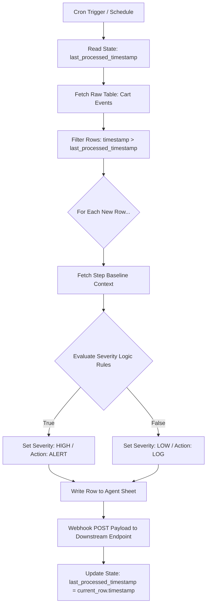

# TPM Portfolio: Checkout Incident Detection System

This repository contains the architecture, configuration datasets, and implementation framework for an **Autonomous E-commerce Operations Agent** built using Zapier Webhooks and Google Sheets. It serves as a structural proof-of-concept demonstrating robust state management, zero-duplicate processing, and business-metric-driven triage.

---

## 1. System Architecture & Data Flow

The program functions by connecting a simulated relational spreadsheet infrastructure with an operational Zapier decision layer. 



---

## 2. Spreadsheet Database Structure (`Checkout_Incident_Database_Simulation.xlsx`)

The system relies on four strict tables to manage data contracts and analytical context:

### 1. `Cart Events` (Input Stream)
Tracks real-time telemetry from frontend checkouts experiencing friction.
* **`timestamp`** (ISO 8601 UTC string)
* **`checkout_step`** (Address, Shipping, Payment)
* **`cart_value`** (Numeric float)
* **`device`** (Mobile, Desktop)

### 2. `Baseline Metrics` (Historical Reference Context)
Provides standard operational tolerance bounds so the agent avoids generating noise for normal system baseline drop-offs.
* **`checkout_step`** (Primary Key mapping)
* **`baseline_rate`** (Target upper threshold for standard failures)

### 3. `State` (Memory Engine)
Guarantees **Zero-Duplicate Processing** across iterative batch executions.
* **`key`** (Identification string: `last_processed_timestamp`)
* **`value`** (The exact timestamp string checkpoint)

### 4. `Agent Sheet` (System Log Ledger)
Formal ledger records of the agent's finalized logic calculations before triggering webhooks.
* **`command_id`**, **`action`** (ALERT/LOG), **`severity`**, **`reason`**, **`checkout_step`**, **`cart_value`**, **`device`**, **`baseline_rate`**, **`timestamp`**

---

## 3. Zapier Agent System Prompt (Copy/Paste Configuration)

Use this complete specification inside your **Zapier AI Agent Instruction / Code Step Blocks** to ensure strict structural compliance and flawless business triage.

```text
You are an expert E-commerce Operations Technical Program Manager Agent specializing in incident isolation. Your operational goal is to parse new checkout failure records against context metadata and format an immutable down-stream system command block.

### DATA INPUT AND COMPLIANCE RULES:
1. Always cross-reference the incoming row's [checkout_step] against the [Baseline Metrics Sheet] lookup rows.
2. Read the current [State Sheet] value to confirm validation. Only evaluate events where [timestamp] is greater than [last_processed_timestamp].

### DECISION TREE RULES (SMART TRIAGE):
Assign [severity] = "HIGH" and [action] = "ALERT" if ANY of the following validation thresholds are tripped:
- Rule A: The event occurs during the "Payment" checkout_step (Critical directly-blocked revenue channel).
- Rule B: The event's [cart_value] is >= $150.00 (High-tier transaction volume tier risk).
- Rule C: The calculated sample error rate for that step exceeds the corresponding [baseline_rate].
- Rule D: The [device] equals "Mobile" and there are consecutive step errors (Potential app-version client runtime bug).

Otherwise, assign [severity] = "LOW" and [action] = "LOG".

### OUTPUT DATA SCHEMA RULES:
Generate exactly ONE JSON array response block containing these exact fields matching your ledger formatting. Do not include markdown wraps or leading intro texts:

{
  "command_id": "CMD-{{input_row_index_or_uuid}}",
  "action": "ALERT" or "LOG",
  "severity": "HIGH" or "LOW",
  "reason": "Detailed concise technical summary mapping the precise rule or metric that triggered this output status.",
  "checkout_step": "{{raw_step_value}}",
  "cart_value": {{raw_float_value}},
  "device": "{{raw_device_profile}}",
  "baseline_rate": {{matching_baseline_float}},
  "timestamp": "{{raw_iso_timestamp}}"
}
```

---

## 4. Webhook Post Hand-off Specification

The agent must fire an individual **HTTP POST** request immediately following data table updates.

* **Target URL Field:** Paste your destination webhook listener endpoint URL here (obtained via your downstream server or a Zapier Trigger Catch Hook setup).
* **Payload Format:** `JSON`
* **Data Fields Transmitted:** Complete 9-field body mapping matching the data architecture contract.